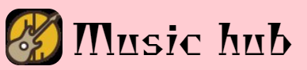

***
# This is music instrument learning website.

***

## Features:
* In Home Page show the most popular course that enrolled highest Person
* A user can select a curse and also can enrolled this curse. After confirm payment complete enrolled.
* This site has awesome dashboard. It changes base on the user role,
* If a user is Admin he can make a user admin or instructor and he also can approve/denied the course which add the instructor.
* A admin can send feedback to the instructor for denied/approved reasons ans a instructor can show the feedback.
* If a user is instructor he can add a course and he also show his all courses which he added.
* This site also has theme system. A user can toggle theme in light?dark.

***

## Technology: 
* React
* React Router
* Firebase
* Express
* MongoDB
* Tailwind
* Tanstack Query
* AXIOS

***
## Packages:
* AOS Animation
* lottie Animation
* React Hook Form
* React Icon
* React Toastify
* React Tooltip
* sweetalert2
* Swiper

## Live Link

[Visit my website](https://music-hub-8cb59.web.app/)

